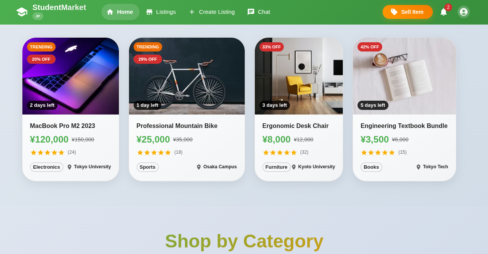

# Student Market — Marketplace for Foreign Students in Japan

**Student Market** is an online marketplace built for foreign students living in Japan. It allows students to browse, buy, sell, or exchange items — making it easier to find affordable goods and connect within the student community. The project is designed as a full‑stack platform, with a React frontend and a backend folder ready for a Laravel or React-based API.

---


## 🖼 Project Screenshot



---

## 🛠 Tech Stack (Frontend)

- **React** — UI library for building dynamic user interfaces  
- **Material UI** — For responsive, modern UI components and layouts  
- **React Router DOM** — For client‑side routing and navigation  

The backend folder is reserved for future expansion: you can add a **Laravel** backend (for APIs, authentication, data persistence) or a **React‑based backend/API**, allowing this project to evolve into a full‑stack application.  

---

## ✅ Features & Benefits

🎯 Student‑focused marketplace — Ideal for students in Japan to trade items without language or cultural barriers
📱 Responsive UI — Works well on desktop and mobile, thanks to Material UI
🔄 Client‑side routing — Smooth navigation without full page reloads using React Router DOM
🧰 Ready for API integration — Backend can be added later (Laravel or other) to make the app fully functional

## 🚀 Getting Started — Run Frontend Locally

Follow these steps to run the frontend on your local machine:

1. **Clone the repository**

```bash
git clone https://github.com/mohakamran/student-market.git
npm install
npm start

